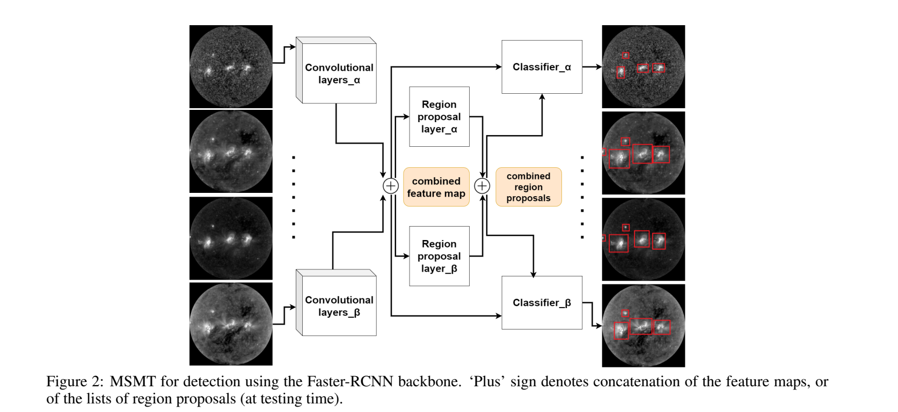

# Active Region Detection in Multi-spectral Solar Images

This repository contains the implementation of the research work [Active Region Detection in Multi-spectral Solar Images](https://www.scitepress.org/Link.aspx?doi=10.5220/0010310504520459). 





## Features

This repository implements:
- Active region detection and segmentation in multi-spectral solar images.
- Multi-layer and multi-task object detection using MLMT-CNN.
- Fully trained on solar datasets with support for multi-spectral inputs.

## Dataset

The dataset used in this project is available at: [https://zenodo.org/records/7950721](https://zenodo.org/records/7950721).


## Installation

To clone the repository and set up the environment, follow these steps:

**Clone the Repository**:
   ```bash
   git clone https://github.com/your-repository-url.git
   cd your-repository-folder
   ```

**Install Required Libraries: Install the dependencies listed below using pip:**
```bash
pip install numpy opencv-python matplotlib tensorflow keras
```

**Usage**

To run the code, follow these steps:
- Download the dataset from Zenodo.
- to run, modify the configuration and run one of the following files: train_MLMT_1.0.py, for training, or measure_map_multitask-Vis-1.2.py for evaluation.


## Citation

If you use this repository, please consider citing the following works:

1. [MLMT-CNN - Object Detection and Segmentation in Multi-layer and Multi-spectral images](https://doi.org/10.1007/s00138-021-01261-y)
2. [Active Region Detection in Multi-spectral Solar Images](https://www.scitepress.org/Link.aspx?doi=10.5220/0010310504520459)
3. [MSMT-CNN for Solar Active Region Detection with Multi-Spectral Analysis](https://doi.org/10.1007/s42979-022-01088-y)
